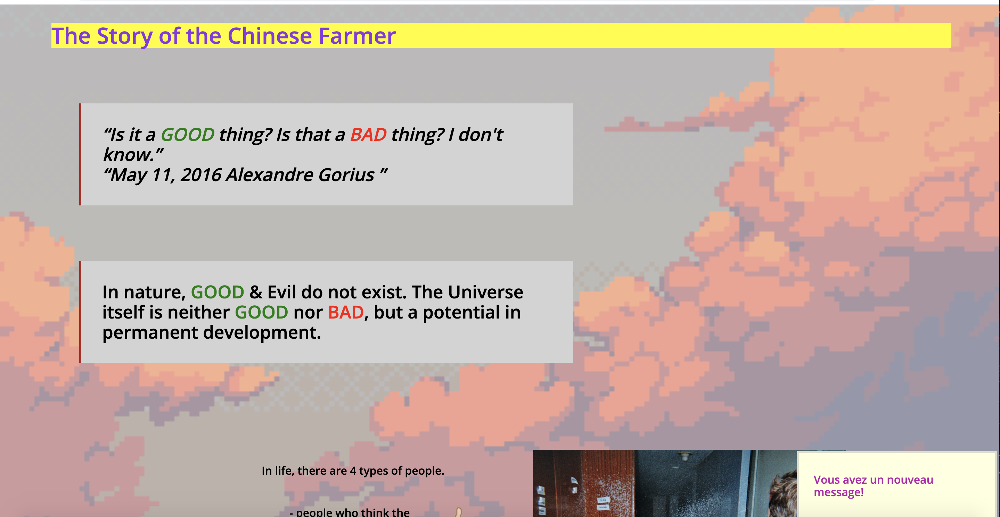

# Introduction to HTML & CSS
This project has been made to introduce you to the basic HTML and CSS programming languages.

## By who ?
This project has been made by Alexandre Albelice, on the 28th of October 2020.

## How ?
I followed the guidelines from the previous README.md and checked a few useful links like those :

- https://www.w3schools.com/css/css_inline-block.asp
- https://developer.mozilla.org/fr/docs/Apprendre/CSS/CSS_layout/Flexbox
- https://www.geeksforgeeks.org/how-to-set-alternate-table-row-color-using-css/
- https://www.w3schools.com/cssref/sel_nth-child.asp

After that I've done all the exercises, I used **https://validator.w3.org/** to check if there were any mistakes in my HTML code.

I used **https://github.com/necolas/normalize.css/blob/master/normalize.css** to be sure that even if I had a mistake about the CSS, this css file would turn mine into a correct one.

## Wich languages ?
- HTML
- CSS

 
